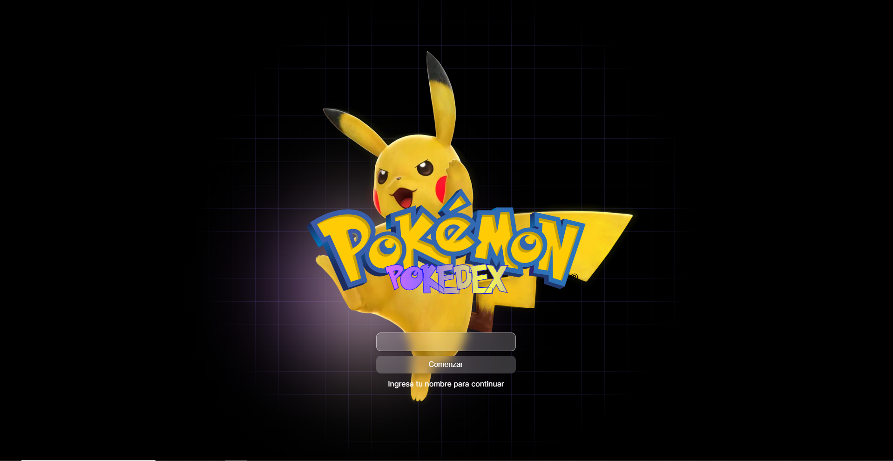

<!-- PROJECT LOGO -->

  

  <h3 align="center">POKEDEX | A MODERN POKEDEX APP</h3>
  

    Espectacular ejercicio de portafolio, creada con react, Utilizando únicamente css moderno para los estilos.Dive into the fascinating world of Pokémon with this interactive app that lets you explore and learn about your favorite creatures. Powered by React, the Pokedex App offers an intuitive and engaging interface so you can search, filter, and get detailed information about each Pokémon.
     
    <a href="https://best-pokedex.netlify.app/"><strong>Demo »</strong></a>
     
  

  

# Versión App
- **Versión:** 1.0
- **Fecha (UTC):** 2025-02-08 22:45:57

# PokeApi

[[Api utilizada](https://pokeapi.co/)]

# Tecnologías

1.  **React**
1.  [[**Axios**]](https://axios-http.com/es/)
2.  [[**React-Router**]](https://reactrouter.com/)]
3.  [[**Zustand**]](https://zustand-demo.pmnd.rs/)
4.  **JavaScript**
5.  **Css**

